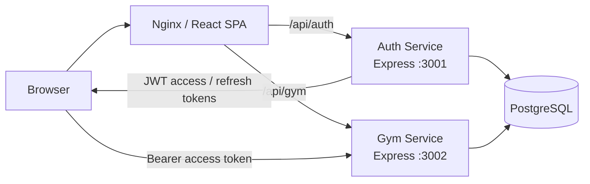

<div align="center">
  

# GymCRM

**A client management system for a gym, built as a small client-server application with separate authentication and business-logic services.**

[Русская версия](README.ru.md)


</div>

## Contents

- [About the project](#about-the-project)
- [Team contribution](#team-contribution)
- [Features](#features)
- [Technology stack](#technology-stack)
- [Architecture](#architecture)
- [Project structure](#project-structure)
- [Requirements](#requirements)
- [Quick start with Docker](#quick-start-with-docker)
- [Frontend development mode](#frontend-development-mode)
- [API overview](#api-overview)
- [Authentication model](#authentication-model)
- [Environment variables](#environment-variables)
- [Data model](#data-model)
- [Security notes](#security-notes)
- [Known limitations](#known-limitations)
- [License](#license)

## About the project

GymCRM is a web application for basic gym customer management. It was originally developed by two students as a university laboratory project and was later consolidated into a single reproducible repository.

The application covers the core workflow of a small gym: staff authentication, client records, subscriptions, visits, dashboard statistics, and profile information. The backend is split into two Node.js/Express services that share a PostgreSQL database, while the frontend is a React single-page application served by Nginx.

## Team contribution

- **Backend — Mikururo**
- **Frontend — DenZar03**

## Features

- staff registration and authentication;
- JWT access and refresh tokens;
- optional administrator bootstrap through environment variables;
- client creation, editing, deletion, search, and pagination;
- client detail pages with subscription and visit information;
- subscription creation, editing, deletion, and status tracking;
- visit registration, filtering, deletion, and daily statistics;
- dashboard with client, subscription, visit, and revenue indicators;
- role-aware UI for `admin` and `trainer` accounts;
- administrator-only visit deletion enforced on the server;
- Swagger/OpenAPI documentation for both backend services;
- Docker Compose setup for the complete application.

## Technology stack

### Frontend

- React 18
- TypeScript
- Vite
- React Router
- TanStack Query
- Zustand
- Axios
- React Hook Form + Zod
- Recharts
- Tailwind CSS
- Radix UI components

### Backend

- Node.js
- TypeScript
- Express
- PostgreSQL
- `pg`
- JWT (`jsonwebtoken`)
- bcryptjs
- Swagger / OpenAPI

### Infrastructure

- Docker
- Docker Compose
- Nginx
- PostgreSQL 15

## Architecture



The **auth-service** is responsible for registration, login, token refresh, logout, and the current-user endpoint. The **gym-service** handles clients, subscriptions, visits, and statistics. Both services work with the same PostgreSQL database.

The frontend does not connect to the database directly. In the Docker setup, Nginx serves the React build and proxies API requests to the corresponding backend service.

## Project structure

```text
.
├── backend/
│   ├── init.sql
│   ├── shared/
│   │   └── types/
│   └── services/
│       ├── auth-service/
│       └── gym-service/
├── frontend/
│   ├── public/
│   ├── src/
│   │   ├── api/
│   │   ├── components/
│   │   ├── hooks/
│   │   ├── pages/
│   │   ├── store/
│   │   ├── types/
│   │   └── utils/
│   ├── Dockerfile
│   └── nginx.conf
├── .env.example
├── .gitignore
├── docker-compose.yml
├── README.md
└── README.ru.md
```

## Requirements

For the recommended setup you only need:

- Docker;
- Docker Compose.

For frontend development outside Docker, Node.js 18+ is also required.

## Quick start with Docker

### 1. Create the local environment file

Linux/macOS:

```bash
cp .env.example .env
```

PowerShell:

```powershell
Copy-Item .env.example .env
```

### 2. Replace the example secrets

At minimum, change:

```env
POSTGRES_PASSWORD=...
JWT_ACCESS_SECRET=...
JWT_REFRESH_SECRET=...
```

Docker Compose builds the internal `DATABASE_URL` from the PostgreSQL variables, so it does not need to be duplicated in `.env`.

Use long random values for JWT secrets.

### 3. Optional: configure an administrator account

Public registration creates **trainer** accounts only. This prevents a user from assigning themselves the administrator role through the registration form or a crafted API request.

To create an administrator automatically on the first startup, set:

```env
BOOTSTRAP_ADMIN_EMAIL=admin@example.com
BOOTSTRAP_ADMIN_PASSWORD=replace_with_a_strong_password
BOOTSTRAP_ADMIN_NAME=Administrator
```

If `BOOTSTRAP_ADMIN_EMAIL` or `BOOTSTRAP_ADMIN_PASSWORD` is empty, no administrator is created automatically.

### 4. Start the application

```bash
docker compose up --build
```

After startup:

- Web application: `http://localhost`
- Auth service: `http://localhost:3001`
- Gym service: `http://localhost:3002`
- Auth Swagger UI: `http://localhost:3001/docs`
- Gym Swagger UI: `http://localhost:3002/docs`

### 5. Stop the application

```bash
docker compose down
```

To also remove the PostgreSQL volume and start with an empty database:

```bash
docker compose down -v
```

## Frontend development mode

The frontend can be run separately while the backend services are available on ports `3001` and `3002`.

```bash
cd frontend
npm ci
cp .env.example .env
npm run dev
```

PowerShell equivalent for the environment file:

```powershell
Copy-Item .env.example .env
```

The Vite development server starts on `http://localhost:5173`.

## API overview

### Auth service

| Method | Endpoint | Purpose |
|---|---|---|
| `POST` | `/auth/register` | Register a trainer account |
| `POST` | `/auth/login` | Sign in |
| `POST` | `/auth/refresh` | Refresh JWT tokens |
| `POST` | `/auth/logout` | Sign out |
| `GET` | `/auth/me` | Read the current user profile |
| `GET` | `/health` | Service health check |

### Gym service

| Resource | Main operations |
|---|---|
| `/clients` | list, create, read, update, delete |
| `/clients/:id/stats` | client statistics |
| `/subscriptions` | list, create, read, update, delete |
| `/visits` | list, create, delete |
| `/visits/stats/daily` | daily visit statistics |
| `/health` | service health check |

All `/clients`, `/subscriptions`, and `/visits` routes require a valid access token. Visit deletion additionally requires the `admin` role.

## Authentication model

The auth service issues two tokens:

- **access token** — sent in the `Authorization: Bearer ...` header to protected endpoints;
- **refresh token** — used to obtain a new access token without entering the password again.

The frontend automatically attaches the access token and attempts a refresh when a protected request returns `401`.

Public registration is intentionally restricted to the `trainer` role. Administrator credentials are configured through local environment variables and are not stored in the repository.

## Environment variables

| Variable | Required | Description |
|---|---:|---|
| `POSTGRES_DB` | yes | PostgreSQL database name |
| `POSTGRES_USER` | yes | PostgreSQL user |
| `POSTGRES_PASSWORD` | yes | PostgreSQL password |
| `JWT_ACCESS_SECRET` | yes | Access-token signing secret |
| `JWT_REFRESH_SECRET` | yes | Refresh-token signing secret |
| `BOOTSTRAP_ADMIN_EMAIL` | no | Optional initial administrator email |
| `BOOTSTRAP_ADMIN_PASSWORD` | no | Optional initial administrator password |
| `BOOTSTRAP_ADMIN_NAME` | no | Optional initial administrator display name |

## Data model

The PostgreSQL schema contains four main entities:

- `users` — staff accounts and roles;
- `clients` — gym customers;
- `subscriptions` — client membership records;
- `visits` — gym visits.

Deleting a client cascades to the related subscriptions and visits through database foreign keys.

## Security notes

- passwords are hashed with bcrypt before storage;
- JWT secrets and database credentials are read from environment variables;
- public registration cannot create an administrator;
- an administrator account can be bootstrapped without placing credentials in source code;
- protected gym endpoints require a valid JWT access token;
- administrator-only visit deletion is checked by the backend;

## Known limitations

- there is no staff-management screen in the current version;
- password changing and password recovery are not implemented;
- visits are not linked to a specific trainer in the database;
- automated tests are not included yet;
- the role model is intentionally small and contains only `admin` and `trainer` staff roles.

## License

No open-source license has been applied to this project.
