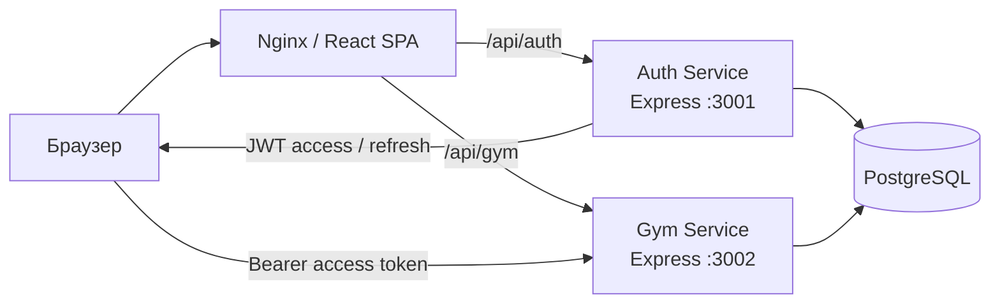

<div align="center">
  

# GymCRM

**Система учёта клиентов тренажёрного зала, реализованная как небольшое клиент-серверное приложение с отдельными сервисами авторизации и бизнес-логики.**

[English version](README.md)


</div>

## Содержание

- [О проекте](#о-проекте)
- [Вклад участников](#вклад-участников)
- [Возможности](#возможности)
- [Технологический стек](#технологический-стек)
- [Архитектура](#архитектура)
- [Структура проекта](#структура-проекта)
- [Требования](#требования)
- [Быстрый запуск через Docker](#быстрый-запуск-через-docker)
- [Режим разработки frontend](#режим-разработки-frontend)
- [Основные API-маршруты](#основные-api-маршруты)
- [Авторизация](#авторизация)
- [Переменные окружения](#переменные-окружения)
- [Модель данных](#модель-данных)
- [Безопасность](#безопасность)
- [Известные ограничения](#известные-ограничения)
- [Лицензия](#лицензия)

## О проекте

GymCRM — веб-приложение для базового учёта клиентов тренажёрного зала. Изначально проект разрабатывался двумя студентами в рамках лабораторной работы, а позднее разрозненные части были объединены в единый воспроизводимый репозиторий.

Приложение охватывает основные сценарии небольшого тренажёрного зала: авторизацию сотрудников, ведение клиентской базы, работу с абонементами, фиксацию посещений, просмотр статистики и данных профиля. Backend разделён на два сервиса Node.js/Express, работающих с общей PostgreSQL-базой, а frontend представляет собой одностраничное React-приложение, которое в Docker-сборке обслуживается через Nginx.

## Вклад участников

- **Backend — Mikururo**
- **Frontend — DenZar03**

## Возможности

- регистрация и авторизация сотрудников;
- JWT access- и refresh-токены;
- необязательное создание учётной записи администратора через переменные окружения;
- создание, редактирование, удаление, поиск и постраничный вывод клиентов;
- подробная карточка клиента с информацией об абонементе и посещениях;
- создание, редактирование, удаление и отслеживание состояния абонементов;
- фиксация, фильтрация и удаление посещений;
- ежедневная статистика посещений;
- дашборд с показателями по клиентам, абонементам, посещениям и выручке;
- роли `admin` и `trainer` в пользовательском интерфейсе;
- серверная проверка роли администратора при удалении посещения;
- Swagger/OpenAPI-документация для обоих backend-сервисов;
- единый запуск всего приложения через Docker Compose.

## Технологический стек

### Frontend

- React 18
- TypeScript
- Vite
- React Router
- TanStack Query
- Zustand
- Axios
- React Hook Form + Zod
- Recharts
- Tailwind CSS
- компоненты Radix UI

### Backend

- Node.js
- TypeScript
- Express
- PostgreSQL
- `pg`
- JWT (`jsonwebtoken`)
- bcryptjs
- Swagger / OpenAPI

### Инфраструктура

- Docker
- Docker Compose
- Nginx
- PostgreSQL 15

## Архитектура



**auth-service** отвечает за регистрацию, вход, обновление токенов, выход и получение данных текущего пользователя. **gym-service** обрабатывает клиентов, абонементы, посещения и статистику. Оба сервиса работают с одной PostgreSQL-базой данных.

Frontend не обращается к базе напрямую. В Docker-конфигурации Nginx раздаёт собранное React-приложение и перенаправляет API-запросы в нужный backend-сервис.

## Структура проекта

```text
.
├── backend/
│   ├── init.sql
│   ├── shared/
│   │   └── types/
│   └── services/
│       ├── auth-service/
│       └── gym-service/
├── frontend/
│   ├── public/
│   ├── src/
│   │   ├── api/
│   │   ├── components/
│   │   ├── hooks/
│   │   ├── pages/
│   │   ├── store/
│   │   ├── types/
│   │   └── utils/
│   ├── Dockerfile
│   └── nginx.conf
├── .env.example
├── .gitignore
├── docker-compose.yml
├── README.md
└── README.ru.md
```

## Требования

Для рекомендуемого способа запуска достаточно:

- Docker;
- Docker Compose.

Для отдельной разработки frontend также потребуется Node.js 18+.

## Быстрый запуск через Docker

### 1. Создайте локальный файл окружения

Linux/macOS:

```bash
cp .env.example .env
```

PowerShell:

```powershell
Copy-Item .env.example .env
```

### 2. Замените демонстрационные секреты

Как минимум измените:

```env
POSTGRES_PASSWORD=...
JWT_ACCESS_SECRET=...
JWT_REFRESH_SECRET=...
```

Docker Compose формирует внутренний `DATABASE_URL` из переменных PostgreSQL, поэтому дублировать строку подключения в `.env` не требуется.

Для JWT следует использовать длинные случайные значения.

### 3. При необходимости настройте администратора

Публичная регистрация создаёт только учётные записи **тренеров**. Пользователь не может назначить себе роль администратора через форму регистрации или вручную сформированный API-запрос.

Для автоматического создания администратора при первом запуске заполните:

```env
BOOTSTRAP_ADMIN_EMAIL=admin@example.com
BOOTSTRAP_ADMIN_PASSWORD=replace_with_a_strong_password
BOOTSTRAP_ADMIN_NAME=Administrator
```

Если `BOOTSTRAP_ADMIN_EMAIL` или `BOOTSTRAP_ADMIN_PASSWORD` оставить пустым, администратор автоматически создаваться не будет.

### 4. Запустите приложение

```bash
docker compose up --build
```

После запуска доступны:

- веб-приложение: `http://localhost`
- auth-service: `http://localhost:3001`
- gym-service: `http://localhost:3002`
- Swagger auth-service: `http://localhost:3001/docs`
- Swagger gym-service: `http://localhost:3002/docs`

### 5. Остановка

```bash
docker compose down
```

Чтобы дополнительно удалить том PostgreSQL и начать с пустой базы:

```bash
docker compose down -v
```

## Режим разработки frontend

Frontend можно запустить отдельно, если backend-сервисы доступны на портах `3001` и `3002`.

```bash
cd frontend
npm ci
cp .env.example .env
npm run dev
```

В PowerShell:

```powershell
Copy-Item .env.example .env
```

Vite запустит приложение по адресу `http://localhost:5173`.

## Основные API-маршруты

### Auth service

| Метод | Маршрут | Назначение |
|---|---|---|
| `POST` | `/auth/register` | Регистрация тренера |
| `POST` | `/auth/login` | Вход |
| `POST` | `/auth/refresh` | Обновление JWT-токенов |
| `POST` | `/auth/logout` | Выход |
| `GET` | `/auth/me` | Данные текущего пользователя |
| `GET` | `/health` | Проверка состояния сервиса |

### Gym service

| Ресурс | Основные операции |
|---|---|
| `/clients` | список, создание, просмотр, изменение, удаление |
| `/clients/:id/stats` | статистика клиента |
| `/subscriptions` | список, создание, просмотр, изменение, удаление |
| `/visits` | список, создание, удаление |
| `/visits/stats/daily` | статистика посещений по дням |
| `/health` | проверка состояния сервиса |

Все маршруты `/clients`, `/subscriptions` и `/visits` требуют действующего access-токена. Удаление посещения дополнительно требует роль `admin`.

## Авторизация

Auth-service выдаёт два токена:

- **access token** — отправляется в заголовке `Authorization: Bearer ...` при обращении к защищённым маршрутам;
- **refresh token** — используется для получения нового access-токена без повторного ввода пароля.

Frontend автоматически добавляет access-токен к запросам и пытается обновить его при ответе `401`.

Публичная регистрация намеренно ограничена ролью `trainer`. Данные администратора задаются только через локальные переменные окружения и не хранятся в исходном коде.

## Переменные окружения

| Переменная | Обязательна | Назначение |
|---|---:|---|
| `POSTGRES_DB` | да | название базы PostgreSQL |
| `POSTGRES_USER` | да | пользователь PostgreSQL |
| `POSTGRES_PASSWORD` | да | пароль PostgreSQL |
| `JWT_ACCESS_SECRET` | да | ключ подписи access-токена |
| `JWT_REFRESH_SECRET` | да | ключ подписи refresh-токена |
| `BOOTSTRAP_ADMIN_EMAIL` | нет | email первоначального администратора |
| `BOOTSTRAP_ADMIN_PASSWORD` | нет | пароль первоначального администратора |
| `BOOTSTRAP_ADMIN_NAME` | нет | отображаемое имя администратора |

## Модель данных

В PostgreSQL используются четыре основные сущности:

- `users` — учётные записи сотрудников и роли;
- `clients` — клиенты тренажёрного зала;
- `subscriptions` — абонементы клиентов;
- `visits` — посещения.

При удалении клиента связанные с ним абонементы и посещения удаляются каскадно посредством внешних ключей базы данных.

## Безопасность

- пароли сохраняются в виде bcrypt-хешей;
- JWT-ключи и данные PostgreSQL читаются из переменных окружения;
- публичная регистрация не позволяет создать администратора;
- первоначального администратора можно создать без хранения его пароля в исходном коде;
- защищённые маршруты gym-service требуют корректный JWT access-токен;
- удаление посещения проверяет роль администратора на стороне backend;C:\Users\I\Downloads\gym-project-GitHub-ready\gym-project

## Известные ограничения

- отдельного интерфейса управления сотрудниками в текущей версии нет;
- смена и восстановление пароля не реализованы;
- посещение не привязывается к конкретному тренеру в базе данных;
- автоматические тесты пока отсутствуют;
- ролевая модель намеренно ограничена ролями `admin` и `trainer`.

## Лицензия

Для данного проекта не выбрана лицензия с открытым исходным кодом.
